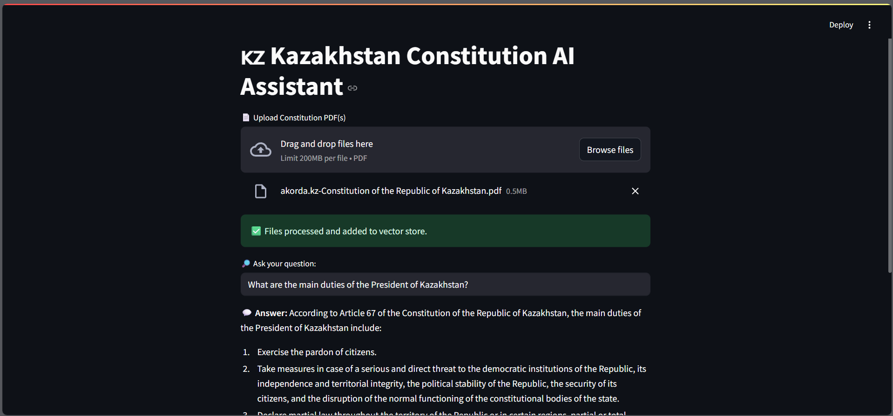
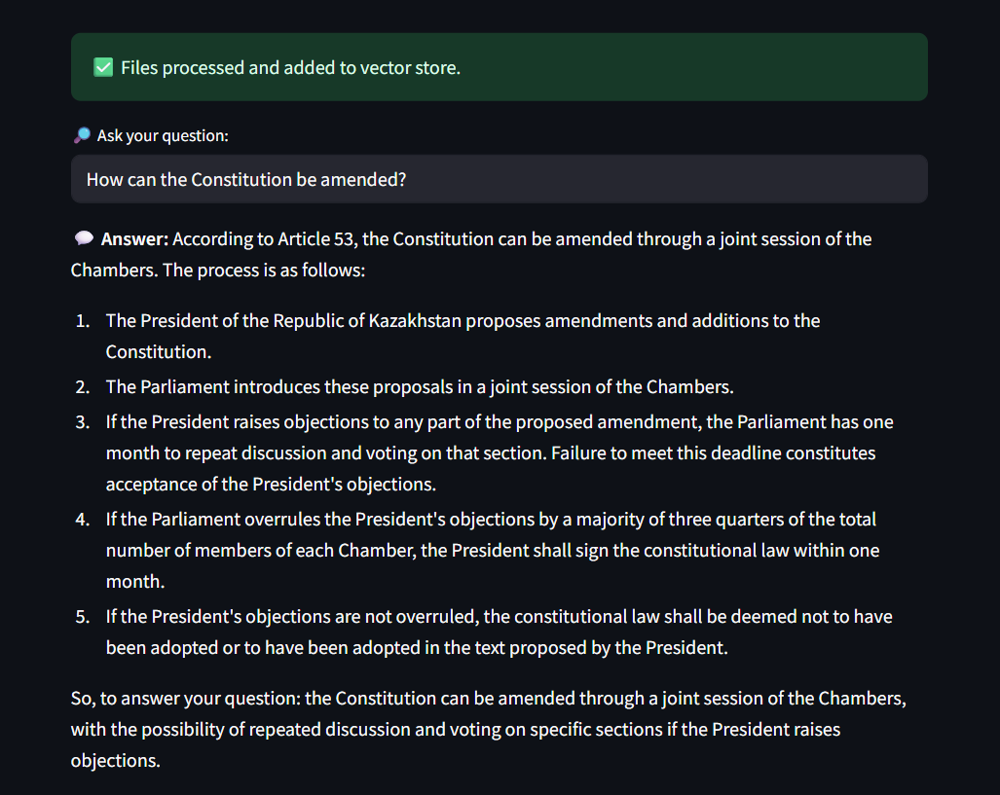

# 🇰🇿 Constitution of Kazakhstan — AI Assistant

This is a **local AI assistant** that can answer questions about the Constitution of the Republic of Kazakhstan using **Retrieval-Augmented Generation (RAG)** with:

- 🧠 **Ollama (LLaMA3 model)** — powerful local LLM
- 📁 **Chroma** — simple local vector store
- 🧾 **Streamlit** — user interface

---

## ✨ Features

✅ Ask natural language questions about the Constitution  
✅ Upload and process multiple PDF files  
✅ Fully offline and private — no API keys needed  
✅ Based on local LLM + local vector store

---

## 📸 Screenshot

> Sample UI (replace with your own if desired):




---

## 🚀 Quick Start

### 1. Clone this repo

```bash
git clone https://github.com/your-username/constitution-ai-assistant.git
cd constitution-ai-assistant
```

### 2. Install dependencies

```bash
pip install -r requirements.txt
pip install -U langchain-community langchain-ollama langchain-chroma
```

### 3. Pull and start Ollama with LLaMA3

```bash
ollama pull llama3
ollama serve
```

> ⚠️ **Note:** The `llama3` model requires at least **6 GB of free RAM**.  
> If your system has less memory, consider using a lighter model like `gemma:2b`.

### 4. Run the Streamlit app

In a **new terminal window**:

```bash
streamlit run main.py
```

---
## 🧪 Example Questions

Here are some questions you can ask the assistant:

- What are the main duties of the President of Kazakhstan?
- Is freedom of religion protected in the Constitution?
- What is the role of the Mazhilis and the Senate?

---
## 🧠 Technologies

- [LangChain](https://github.com/langchain-ai/langchain)
- [ChromaDB](https://www.trychroma.com/)
- [Ollama](https://ollama.com/)
- [Streamlit](https://streamlit.io/)

---

## 📄 License

MIT
